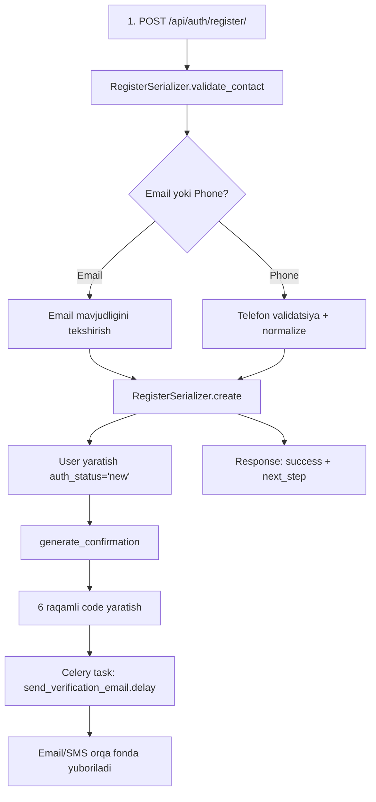
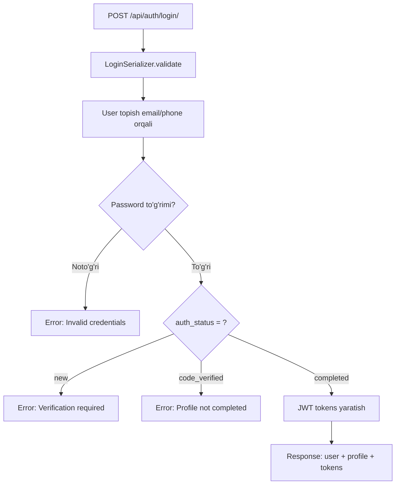

# 📸 Instagram Clone Loyihasi - To'liq Tushuntirish

Bu hujjatda Instagram Clone loyihasining barcha fayllari, ularning maqsadi va ishlash tartibi ketma-ketlikda tushuntirilgan.

---

## Loyiha Tuzilishi

```
instagram_clone/
├── config/                 # Django asosiy sozlamalari
│   ├── settings.py        # Barcha sozlamalar
│   ├── urls.py            # Asosiy URL routing
│   ├── celery.py          # Celery task queue sozlamalari
│   └── wsgi.py/asgi.py    # Server sozlamalari
│
├── accounts/               # Foydalanuvchi autentifikatsiyasi
│   ├── models.py          # User, Profile, UserConfirmation
│   ├── serializers.py     # API serializers
│   ├── views.py           # API endpointlar
│   ├── urls.py            # Auth URL routing
│   ├── tasks.py           # Celery tasks (email yuborish)
│   ├── services.py        # Biznes logika
│   ├── throttles.py       # Rate limiting
│   ├── utils.py           # Telefon validatsiya
│   └── signals.py         # Avtomatik profile yaratish
│
├── social/                 # Follow tizimi
│   ├── models.py          # Follow model
│   ├── serializers.py     # Follow serializers
│   ├── views.py           # Follow endpointlar
│   ├── urls.py            # Social URL routing
│   └── signals.py         # Count yangilash
│
├── shared/                 # Umumiy komponentlar
│   └── models.py          # BaseModel (UUID, timestamps)
│
├── media/                  # Yuklangan fayllar
├── .env                    # Environment o'zgaruvchilari
├── Pipfile                 # Python dependencies
└── manage.py               # Django CLI
```

---

# BIRINCHI QADAM: LOYIHA KONFIGURATSIYASI

## 1. [config/settings.py](file:///c:/Users/User/Desktop/instagaram_clone/config/settings.py) - Asosiy Sozlamalar

Bu fayl Django loyihasining bosh konfiguratsiya fayli. Barcha sozlamalar shu yerda.

### Muhim bo'limlar:

````python
# 1. ENVIRONMENT O'ZGARUVCHILARI
SECRET_KEY = config("SECRET_KEY")         # Xavfsizlik kaliti (.env dan olinadi)
DEBUG = config("DEBUG", default=True)     # Development mode
ALLOWED_HOSTS = config("ALLOWED_HOSTS")   # Ruxsat etilgan hostlar
````

````python
# 2. O'RNATILGAN ILOVALAR
INSTALLED_APPS = [
    # Django standart
    "django.contrib.admin",
    "django.contrib.auth",
    ...
    
    # Third-party
    "rest_framework",              # DRF - API uchun
    "rest_framework_simplejwt",    # JWT authentation
    "django_celery_beat",          # Periodic tasks
    "django_celery_results",       # Task natijalarini saqlash

    # Bizning ilovalar
    "accounts",                    # User app
    "shared",                      # Umumiy modellar
    "social",                      # Follow tizimi
]
````

````python
# 3. REST FRAMEWORK SOZLAMALARI
REST_FRAMEWORK = {
    'DEFAULT_THROTTLE_RATES': {
        'register': '3/hour',       # 3 ta ro'yxatdan o'tish/soat
        'login': '5/min',           # 5 ta login/minut
        'verify': '5/hour',         # 5 ta tasdiqlash/soat
        ...
    },
    
    # JWT autentifikatsiya
    'DEFAULT_AUTHENTICATION_CLASSES': [
        'rest_framework_simplejwt.authentication.JWTAuthentication',
    ],
    
    # Faqat autentifikatsiya qilingan foydalanuvchilar
    'DEFAULT_PERMISSION_CLASSES': [
        'rest_framework.permissions.IsAuthenticated',
    ],
}
````

````python
# 4. JWT SOZLAMALARI
SIMPLE_JWT = {
    "ACCESS_TOKEN_LIFETIME": timedelta(minutes=60),   # 1 soat
    "REFRESH_TOKEN_LIFETIME": timedelta(days=1),      # 1 kun
    "ROTATE_REFRESH_TOKENS": True,                    # Yangi refresh token
    "BLACKLIST_AFTER_ROTATION": True,                 # Eskisini bloklash
}
````

````python
# 5. DATABASE KONFIGURATSIYASI
DATABASES = {
    "default": {
        "ENGINE": "django.db.backends.postgresql_psycopg2",
        "NAME": config("DATABASE_NAME"),
        "USER": config("DATABASE_USER"),
        "PASSWORD": config("DATABASE_PASSWORD"),
        "HOST": config("DATABASE_HOST"),
        "PORT": config("DATABASE_PORT"),
    }
}
````

````python
# 6. CELERY SOZLAMALARI (Async tasks)
CELERY_BROKER_URL = 'redis://127.0.0.1:6379/0'     # Redis ulanish
CELERY_RESULT_BACKEND = 'redis://127.0.0.1:6379/0'
````

---

## 2. [config/urls.py](file:///c:/Users/User/Desktop/instagaram_clone/config/urls.py) - Asosiy URL Routing

Bu fayl barcha URL yo'nalishlarini birlashtiradi:

````python
urlpatterns = [
    path("admin/", admin.site.urls),                    # Admin panel
    path("api/auth/", include("accounts.urls")),        # Auth endpointlar
    path("api/social/", include("social.urls")),        # Follow endpointlar
]
````

**Natija:**
- `/api/auth/register/` → accounts app
- `/api/auth/login/` → accounts app
- `/api/social/users/{id}/follow/` → social app

---

## 3. [config/celery.py](file:///c:/Users/User/Desktop/instagaram_clone/config/celery.py) - Async Task Queue

Celery - orqa fonda vazifalarni bajarish uchun:

````python
# Celery ilovasini yaratish
app = Celery('instagram_clone')

# Django settings'dan konfiguratsiya
app.config_from_object('django.conf:settings', namespace='CELERY')

# Barcha app'lardan tasks'ni topish
app.autodiscover_tasks()
````

**Nima uchun kerak?**
- Email yuborish vaqt oladi (1-5 sekund)
- Foydalanuvchi kutmasligi uchun, email orqa fonda yuboriladi
- Requestga tezda javob qaytariladi

---

# IKKINCHI QADAM: SHARED (UMUMIY) KOMPONENTLAR

## 4. [shared/models.py](file:///c:/Users/User/Desktop/instagaram_clone/shared/models.py) - Base Model

Barcha modellar uchun umumiy fieldlar:

````python
class BaseModel(models.Model):
    id = models.UUIDField(
        unique=True, 
        default=uuid.uuid4,      # Avtomatik UUID
        editable=False, 
        primary_key=True
    )
    created_at = models.DateTimeField(auto_now_add=True)  # Yaratilgan vaqt
    updated_at = models.DateTimeField(auto_now=True)       # Yangilangan vaqt

    class Meta:
        abstract = True  # Jadval yaratilmaydi, faqat meros uchun
````

**UUID afzalliklari:**
- Global unikal
- Taxmin qilib bo'lmaydi (xavfsizlik)
- Ma'lumotlarni birlashtirish oson

---

# UCHINCHI QADAM: ACCOUNTS APP - AUTENTIFIKATSIYA

Bu eng katta va murakkab app. Ketma-ketlikda ko'rib chiqamiz.

## 5. [accounts/models.py](file:///c:/Users/User/Desktop/instagaram_clone/accounts/models.py) - Ma'lumotlar Modellari

### 5.1 User Role va Status'lar

````python
# Foydalanuvchi roli
class UserRole(models.TextChoices):
    BASIC = 'basic', 'Basic User'      # Oddiy foydalanuvchi
    MANAGER = 'manager', 'Manager'     # Menejer
    ADMIN = 'admin', 'Admin'           # Administrator

# Autentifikatsiya turi
class AuthType(models.TextChoices):
    EMAIL = 'email', 'Email'           # Email orqali
    PHONE = 'phone', 'Phone'           # Telefon orqali
    SOCIAL = 'social', 'Social'        # Ijtimoiy tarmoq orqali

# Autentifikatsiya holati (Registration steps)
class AuthStatus(models.TextChoices):
    NEW = 'new', 'New'                              # Yangi - kod tasdiqlanmagan
    CODE_VERIFIED = 'code_verified', 'Verified'     # Kod tasdiqlangan
    PROFILE_COMPLETED = 'completed', 'Completed'    # Profil to'ldirilgan
    PHOTO_UPLOADED = 'photo_uploaded', 'Photo'      # Rasm yuklangan
````

### 5.2 User Model (Asosiy Foydalanuvchi)

````python
class User(AbstractUser):
    # UUID primary key
    id = models.UUIDField(primary_key=True, default=uuid.uuid4)
    created_at = models.DateTimeField(auto_now_add=True)
    updated_at = models.DateTimeField(auto_now=True)

    # Rol va status
    user_role = models.CharField(choices=UserRole.choices, default=UserRole.BASIC)
    auth_type = models.CharField(choices=AuthType.choices, default=AuthType.EMAIL)
    auth_status = models.CharField(choices=AuthStatus.choices, default=AuthStatus.NEW)

    # Kontakt ma'lumotlari
    email = models.EmailField(unique=False, null=True, blank=True)
    phone_number = models.CharField(max_length=15, unique=True, null=True, blank=True)
    
    # --- MUHIM METODLAR ---
    
    @property
    def full_name(self):
        """To'liq ism"""
        return f"{self.first_name} {self.last_name}".strip()

    def hashing_password(self):
        """Parolni hash qilish"""
        if self.password and not self.password.startswith("pbkdf2_"):
            self.password = make_password(self.password)

    def token(self):
        """JWT tokenlar olish"""
        refresh = RefreshToken.for_user(self)
        return {"access": str(refresh.access_token), "refresh": str(refresh)}

    def save(self, *args, **kwargs):
        """Saqlashdan oldin"""
        if self.email:
            self.email = self.email.lower()  # Email kichik harfga
        self.hashing_password()              # Parolni hash qilish
        super().save(*args, **kwargs)
````

### 5.3 Profile Model

````python
class Profile(models.Model):
    id = models.UUIDField(primary_key=True, default=uuid.uuid4)
    user = models.OneToOneField(User, on_delete=models.CASCADE, related_name='profile')
    
    # Profil ma'lumotlari
    bio = models.TextField(blank=True)                              # Bio
    avatar = models.ImageField(upload_to='avatars/', blank=True)    # Rasm
    website = models.URLField(blank=True)                           # Vebsayt
    location = models.CharField(max_length=100, blank=True)         # Joylashuv
    
    # Follow hisoblagichlar
    followers_count = models.PositiveIntegerField(default=0)
    following_count = models.PositiveIntegerField(default=0)
````

### 5.4 UserConfirmation Model (Tasdiqlash kodlari)

````python
class UserConfirmation(models.Model):
    TYPE_CHOICES = (
        ('email_verification', 'Email Verification'),
        ('phone_verification', 'Phone Verification'),
        ('password_reset', 'Password Reset'),
    )

    id = models.UUIDField(primary_key=True, default=uuid.uuid4)
    user = models.ForeignKey(User, on_delete=models.CASCADE, related_name='confirmations')
    confirmation_type = models.CharField(choices=TYPE_CHOICES)
    code = models.CharField(max_length=6)           # 6 raqamli kod
    token = models.UUIDField(default=uuid.uuid4)    # Reset link uchun
    is_used = models.BooleanField(default=False)    # Ishlatilganmi
    expires_at = models.DateTimeField()             # Muddati

    def save(self, *args, **kwargs):
        if not self.expires_at:
            self.expires_at = timezone.now() + timedelta(minutes=5)  # 5 daqiqa
        super().save(*args, **kwargs)

    def is_expired(self):
        """Muddat o'tganmi?"""
        return timezone.now() > self.expires_at
````

---

## 6. [accounts/urls.py](file:///c:/Users/User/Desktop/instagaram_clone/accounts/urls.py) - Auth URL'lari

````python
urlpatterns = [
    # 1. Ro'yxatdan o'tish
    path("register/", RegisterView.as_view(), name='register'),

    # 2. Code tasdiqlash
    path("verify/", VerifyView.as_view(), name='verify'),

    # 3. Kodni qayta yuborish
    path("resend/", ResendView.as_view(), name='resend'),

    # 4. Profilni to'ldirish
    path("complete-profile/", ProfileCompletionView.as_view(), name='complete-profile'),

    # 5. Login
    path("login/", LoginView.as_view(), name='login'),

    # 6. Parolni unutdim
    path("forgot-password/", ForgotPasswordView.as_view(), name='forgot-password'),

    # 7. Parolni tiklash
    path("reset-password/", ResetPasswordView.as_view(), name='reset-password'),
]
````

---

## 7. [accounts/views.py](file:///c:/Users/User/Desktop/instagaram_clone/accounts/views.py) - API Views

Har bir endpoint uchun alohida View:

### 7.1 RegisterView

````python
class RegisterView(GenericAPIView):
    """User registration - email yoki phone bilan"""
    serializer_class = RegisterSerializer
    permission_classes = [AllowAny]         # Hamma ro'yxatdan o'ta oladi
    throttle_classes = [RegisterRateThrottle]  # 3/soat limit

    def post(self, request):
        serializer = self.get_serializer(data=request.data)
        serializer.is_valid(raise_exception=True)
        serializer.save()
        return Response(serializer.data, status=status.HTTP_201_CREATED)
````

### 7.2 VerifyView

````python
class VerifyView(GenericAPIView):
    """Verification code tasdiqlash"""
    serializer_class = VerifySerializer
    permission_classes = [AllowAny]
    throttle_classes = [VerifyRateThrottle]  # 5/soat limit

    def post(self, request):
        serializer = self.get_serializer(data=request.data)
        serializer.is_valid(raise_exception=True)
        user = serializer.validated_data.get("user")
        serializer.context['user'] = user
        return Response(serializer.data, status=status.HTTP_200_OK)
````

### 7.3 LoginView

````python
class LoginView(GenericAPIView):
    """User login - email yoki phone bilan"""
    serializer_class = LoginSerializer
    permission_classes = [AllowAny]
    throttle_classes = [LoginRateThrottle]  # 5/minut limit

    def post(self, request):
        serializer = self.get_serializer(data=request.data)
        serializer.is_valid(raise_exception=True)
        return Response(serializer.data, status=status.HTTP_200_OK)
````

### 7.4 ProfileCompletionView

````python
class ProfileCompletionView(GenericAPIView):
    """User profilini to'ldirish"""
    serializer_class = ProfileCompletionSerializer
    permission_classes = [IsAuthenticated]  # Faqat login qilganlar

    def put(self, request):
        user = request.user  # JWT'dan olingan user
        serializer = self.get_serializer(user, data=request.data, partial=True)
        serializer.is_valid(raise_exception=True)
        serializer.save()
        return Response(serializer.data, status=status.HTTP_200_OK)
````

---

## 8. [accounts/serializers.py](file:///c:/Users/User/Desktop/instagaram_clone/accounts/serializers.py) - Asosiy Logika

Bu fayl eng katta va muhim - barcha biznes logika shu yerda.

### 8.1 RegisterSerializer

````python
class RegisterSerializer(serializers.ModelSerializer):
    contact = serializers.CharField(write_only=True)   # Email yoki telefon
    password = serializers.CharField(write_only=True)

    class Meta:
        model = User
        fields = ("contact", "password")

    def validate_contact(self, value):
        """Email yoki telefon validatsiya"""
        
        # Email tekshirish
        if "@" in value:
            if User.objects.filter(email=value).exists():
                raise serializers.ValidationError("Email already registered")
            return value
        
        # Telefon tekshirish
        normalized_phone = validate_phone_number(value, default_country='UZ')
        if User.objects.filter(phone_number=normalized_phone).exists():
            raise serializers.ValidationError("Phone number already registered")
        
        return normalized_phone

    def create(self, validated_data):
        """Yangi user yaratish"""
        contact = validated_data["contact"]
        password = validated_data["password"]
        temp_username = str(uuid.uuid4())[:12]  # Vaqtinchalik username
        auth_type = "email" if "@" in contact else "phone"

        # User yaratish
        user = User.objects.create_user(
            username=temp_username,
            email=contact if auth_type=="email" else None,
            phone_number=contact if auth_type=="phone" else None,
            password=password,
            auth_type=auth_type,
            auth_status="new"
        )

        # Tasdiqlash kodi yaratish va yuborish
        generate_confirmation(user, f"{auth_type}_verification")
        return user

    def to_representation(self, instance):
        """API javob formati"""
        contact = instance.email if instance.email else instance.phone_number
        contact_type = "email" if instance.email else "phone"
        
        return {
            "success": True,
            "message": f"Verification code sent to your {contact_type}",
            "data": {
                "user_id": str(instance.id),
                "contact": contact,
                "contact_type": contact_type,
                "auth_status": instance.auth_status,
                "next_step": {
                    "action": "verify",
                    "endpoint": "/api/auth/verify/",
                    "required_fields": ["contact", "code"]
                },
                "code_expires_in": "5 minutes"
            }
        }
````

### 8.2 VerifySerializer

````python
class VerifySerializer(serializers.Serializer):
    contact = serializers.CharField()
    code = serializers.CharField(max_length=6)

    def validate(self, data):
        contact = data["contact"]
        code = data["code"]

        # User topish
        if "@" in contact:
            user = User.objects.get(email=contact.lower())
            ctype = "email_verification"
        else:
            normalized = validate_phone_number(contact)
            user = User.objects.get(phone_number=normalized)
            ctype = "phone_verification"

        # Kodni tekshirish
        ok, msg = verify_code(user, ctype, code)
        if not ok:
            raise serializers.ValidationError(msg)

        # Status yangilash
        user.auth_status = "code_verified"
        user.save()
        data["user"] = user
        return data

    def to_representation(self, instance):
        """JWT tokenlar bilan javob"""
        user = self.context.get("user") or instance.get("user")
        refresh = RefreshToken.for_user(user)
        
        return {
            "success": True,
            "message": "Verification successful! Please complete your profile.",
            "data": {
                "user": {
                    "id": str(user.id),
                    "contact": user.email or user.phone_number,
                    "auth_status": user.auth_status
                },
                "tokens": {
                    "access": str(refresh.access_token),
                    "refresh": str(refresh),
                    "token_type": "Bearer",
                    "expires_in": 3600
                },
                "next_step": {
                    "action": "complete_profile",
                    "endpoint": "/api/auth/complete-profile/"
                }
            }
        }
````

### 8.3 LoginSerializer

````python
class LoginSerializer(serializers.Serializer):
    contact = serializers.CharField()
    password = serializers.CharField(write_only=True)

    def validate(self, data):
        contact = data.get("contact")
        password = data.get("password")

        # User topish
        if "@" in contact:
            user = User.objects.get(email=contact.lower())
        else:
            normalized = validate_phone_number(contact)
            user = User.objects.get(phone_number=normalized)

        # Parol tekshirish
        if not user.check_password(password):
            raise serializers.ValidationError("Invalid credentials")

        # Status tekshirish
        if user.auth_status == "new":
            raise serializers.ValidationError({
                "error": "Verification required",
                "next_step": "verify"
            })

        if user.auth_status == "code_verified":
            raise serializers.ValidationError({
                "error": "Profile not completed",
                "next_step": "complete_profile"
            })

        if user.auth_status != "completed":
            raise serializers.ValidationError("Account setup incomplete")

        data["user"] = user
        return data

    def to_representation(self, instance):
        """To'liq user ma'lumotlari bilan javob"""
        user = instance.get('user')
        refresh = RefreshToken.for_user(user)

        return {
            "success": True,
            "message": f"Welcome back, {user.username}!",
            "data": {
                "user": {
                    "id": str(user.id),
                    "email": user.email,
                    "username": user.username,
                    "full_name": user.full_name,
                },
                "profile": {
                    "bio": user.profile.bio,
                    "avatar": user.profile.avatar.url if user.profile.avatar else None,
                    "followers_count": user.profile.followers_count,
                    "following_count": user.profile.following_count
                },
                "tokens": {
                    "access": str(refresh.access_token),
                    "refresh": str(refresh),
                    "expires_in": 3600
                }
            }
        }
````

---

## 9. [accounts/services.py](file:///c:/Users/User/Desktop/instagaram_clone/accounts/services.py) - Biznes Logika

````python
def generate_confirmation(user, confirmation_type):
    """
    Tasdiqlash kodi yaratish va yuborish
    """
    # Eski kodlarni bekor qilish
    UserConfirmation.objects.filter(
        user=user, 
        confirmation_type=confirmation_type, 
        is_used=False
    ).update(is_used=True)

    # 6 raqamli kod yaratish
    code = str(uuid.uuid4().int)[:6].zfill(6)

    # Confirmation yaratish
    confirmation = UserConfirmation.objects.create(
        user=user,
        confirmation_type=confirmation_type,
        code=code,
        expires_at=timezone.now() + timedelta(minutes=5)
    )

    # Email/SMS yuborish (async)
    from .tasks import send_verification_email, send_password_reset_email
    
    contact = user.email if user.email else user.phone_number
    contact_type = 'email' if user.email else 'phone'
    
    if confirmation_type == 'password_reset':
        reset_link = f"{settings.FRONTEND_URL}/reset-password?token={confirmation.token}"
        send_password_reset_email.delay(contact, reset_link)
    else:
        send_verification_email.delay(contact, code, contact_type)
        print(f"CONFIRMATION CODE for {contact}: {code}")

    return confirmation


def verify_code(user, confirmation_type, code):
    """
    Kodni tekshirish
    """
    try:
        conf = UserConfirmation.objects.get(
            user=user, 
            confirmation_type=confirmation_type, 
            code=code, 
            is_used=False
        )
    except UserConfirmation.DoesNotExist:
        return False, "Code is invalid"

    if conf.is_expired():
        return False, "Code expired"

    conf.is_used = True
    conf.save()
    return True, "Code verified"


def resend_code(user, confirmation_type):
    """Kodni qayta yuborish"""
    return generate_confirmation(user, confirmation_type)
````

---

## 10. [accounts/tasks.py](file:///c:/Users/User/Desktop/instagaram_clone/accounts/tasks.py) - Celery Tasks

Email'larni orqa fonda yuborish:

````python
@shared_task(bind=True, max_retries=3, default_retry_delay=60)
def send_verification_email(self, user_email, code, contact_type='email'):
    """
    Verification code email yuborish
    
    - max_retries=3: Xato bo'lsa 3 marta qayta urinadi
    - default_retry_delay=60: Har 60 sekundda qayta urinadi
    """
    try:
        if contact_type == 'email':
            # HTML email yaratish
            html_message = f"""
            <div style="...">
                <h1>📸 Instagram Clone</h1>
                <div class="code">{code}</div>
                <p>This code will expire in 5 minutes.</p>
            </div>
            """
            
            send_mail(
                subject='📸 Instagram Clone - Email Verification',
                message=f'Your verification code is: {code}',
                from_email='noreply@instagram-clone.com',
                recipient_list=[user_email],
                html_message=html_message,
            )
        else:
            # SMS (kelajakda)
            pass
            
    except Exception as exc:
        # Xato bo'lsa qayta urinish
        raise self.retry(exc=exc, countdown=60)
````

---

## 11. [accounts/utils.py](file:///c:/Users/User/Desktop/instagaram_clone/accounts/utils.py) - Telefon Validatsiya

````python
def validate_phone_number(phone_number, default_country='UZ'):
    """
    Telefon raqamni tekshirish va normalize qilish
    
    Qabul qiladi:
        +998901234567
        998901234567
        901234567
        +998 90 123 45 67
    
    Qaytaradi:
        +998901234567 (E164 format)
    """
    try:
        if phone_number.startswith('+'):
            parsed = phonenumbers.parse(phone_number, None)
        else:
            parsed = phonenumbers.parse(phone_number, default_country)

        if not phonenumbers.is_valid_number(parsed):
            raise ValidationError("Invalid phone number")

        return phonenumbers.format_number(
            parsed,
            phonenumbers.PhoneNumberFormat.E164
        )
    except NumberParseException:
        raise ValidationError("Invalid phone number format")


def format_phone_display(phone_number):
    """
    Foydalanuvchi uchun formatga o'tkazish
    
    +998901234567 → +998 90 123-45-67
    """
    parsed = phonenumbers.parse(phone_number, None)
    return phonenumbers.format_number(
        parsed,
        phonenumbers.PhoneNumberFormat.INTERNATIONAL
    )


# O'zbekiston operatorlari
UZ_OPERATORS = {
    '90': 'Beeline',
    '91': 'Ucell',
    '93': 'Ucell',
    '94': 'Ucell',
    '95': 'Uzmobile',
    '97': 'Uzmobile',
    '98': 'Perfectum',
    '99': 'Uzmobile',
}

def get_uzbek_operator(phone_number):
    """Operator nomi"""
    if phone_number.startswith('+998'):
        operator_code = phone_number[4:6]
        return UZ_OPERATORS.get(operator_code, 'Unknown')
    return 'Unknown'
````

---

## 12. [accounts/throttles.py](file:///c:/Users/User/Desktop/instagaram_clone/accounts/throttles.py) - Rate Limiting

Har bir endpoint uchun rate limit:

````python
class RegisterRateThrottle(AnonRateThrottle):
    """
    Register: 3 ta/soat per IP
    Spam ro'yxatdan o'tishni oldini oladi
    """
    rate = '3/hour'
    scope = 'register'


class LoginRateThrottle(AnonRateThrottle):
    """
    Login: 5 ta/minut per IP
    Brute-force hujumni oldini oladi
    """
    rate = '5/min'
    scope = 'login'


class VerifyRateThrottle(AnonRateThrottle):
    """
    Verify: 5 ta/soat per IP
    Kodni taxmin qilishni oldini oladi
    """
    rate = '5/hour'
    scope = 'verify'


class ContactBasedRateThrottle(SimpleRateThrottle):
    """
    Kontakt asosida limit
    Bir email/telefon bir necha IP'dan hujum qilolmaydi
    """
    scope = 'contact'

    def get_cache_key(self, request, view):
        contact = request.data.get('contact', '')
        return self.cache_format % {
            'scope': self.scope,
            'ident': contact.lower()
        }
````

---

## 13. [accounts/signals.py](file:///c:/Users/User/Desktop/instagaram_clone/accounts/signals.py) - Avtomatik Profile

````python
@receiver(post_save, sender=User)
def create_or_update_user_profile(sender, instance, created, **kwargs):
    """
    User yaratilganda avtomatik Profile yaratadi
    """
    if created:
        # Yangi user - Profile yaratish
        Profile.objects.get_or_create(user=instance)
    else:
        # User yangilangan - Profile sync
        if hasattr(instance, 'profile'):
            instance.profile.save()
````

**Nima uchun kerak?**
- Har bir user'ga Profile kerak
- Har safar qo'lda yaratish shart emas
- Avtomatik bajariladi

---

# TO'RTINCHI QADAM: SOCIAL APP - FOLLOW TIZIMI

## 14. [social/models.py](file:///c:/Users/User/Desktop/instagaram_clone/social/models.py) - Follow Model

````python
class Follow(BaseModel):
    """
    Follow munosabati
    
    follower: Kim follow qilmoqda
    following: Kim follow qilinmoqda
    """
    follower = models.ForeignKey(
        User,
        on_delete=models.CASCADE,
        related_name='following_set',  # user.following_set.all() → Men follow qilganlar
    )
    
    following = models.ForeignKey(
        User,
        on_delete=models.CASCADE,
        related_name='followers_set',  # user.followers_set.all() → Mening followerlarim
    )
    
    class Meta:
        # Bir marta follow qilish mumkin
        unique_together = ('follower', 'following')
        
        # Database indekslari (tezlik uchun)
        indexes = [
            models.Index(fields=['follower', 'following']),
            models.Index(fields=['following', 'follower']),
        ]
    
    def save(self, *args, **kwargs):
        """O'zini follow qilishni oldini olish"""
        if self.follower == self.following:
            raise ValidationError("Users cannot follow themselves")
        super().save(*args, **kwargs)
    
    @classmethod
    def is_following(cls, follower, following):
        """Follow qilganmi tekshirish"""
        return cls.objects.filter(
            follower=follower,
            following=following
        ).exists()
````

---

## 15. [social/urls.py](file:///c:/Users/User/Desktop/instagaram_clone/social/urls.py) - Social URL'lar

````python
urlpatterns = [
    # Follow/Unfollow
    path('users/<uuid:user_id>/follow/', FollowView.as_view()),
    path('users/<uuid:user_id>/unfollow/', UnfollowView.as_view()),
    
    # Ro'yxatlar
    path('users/<uuid:user_id>/followers/', FollowersListView.as_view()),
    path('users/<uuid:user_id>/following/', FollowingListView.as_view()),
    
    # Statistika
    path('users/<uuid:user_id>/stats/', UserStatsView.as_view()),
]
````

---

## 16. [social/views.py](file:///c:/Users/User/Desktop/instagaram_clone/social/views.py) - Follow Views

### 16.1 FollowView

````python
class FollowView(APIView):
    """
    POST /api/social/users/{user_id}/follow/
    """
    permission_classes = [IsAuthenticated]
    
    def post(self, request, user_id):
        follower = request.user
        following = get_object_or_404(User, id=user_id)
        
        # Allaqachon follow qilganmi?
        if Follow.is_following(follower, following):
            return Response({
                "success": False,
                "message": f"Already following @{following.username}"
            }, status=400)
        
        # Follow yaratish
        follow = Follow.objects.create(
            follower=follower,
            following=following
        )
        
        return Response({
            "success": True,
            "message": f"Following @{following.username}"
        }, status=201)
````

### 16.2 UserStatsView

````python
class UserStatsView(APIView):
    """
    GET /api/social/users/{user_id}/stats/
    """
    permission_classes = [IsAuthenticated]
    
    def get(self, request, user_id):
        user = get_object_or_404(User, id=user_id)
        
        followers_count = Follow.objects.filter(following=user).count()
        following_count = Follow.objects.filter(follower=user).count()
        
        # Joriy user bilan munosabat
        is_following = Follow.is_following(request.user, user)
        follows_you = Follow.is_following(user, request.user)
        
        return Response({
            "success": True,
            "data": {
                "user_id": str(user.id),
                "username": user.username,
                "followers_count": followers_count,
                "following_count": following_count,
                "is_following": is_following,
                "follows_you": follows_you,
            }
        })
````

---

## 17. [social/signals.py](file:///c:/Users/User/Desktop/instagaram_clone/social/signals.py) - Count Yangilash

````python
@receiver(post_save, sender=Follow)
def update_counts_on_follow(sender, instance, created, **kwargs):
    """Follow qilinganda countlarni yangilash"""
    if created:
        # Follower'ning following_count +1
        instance.follower.profile.following_count += 1
        instance.follower.profile.save()
        
        # Following'ning followers_count +1
        instance.following.profile.followers_count += 1
        instance.following.profile.save()


@receiver(post_delete, sender=Follow)
def update_counts_on_unfollow(sender, instance, **kwargs):
    """Unfollow qilinganda countlarni yangilash"""
    # Follower'ning following_count -1
    instance.follower.profile.following_count = max(0, 
        instance.follower.profile.following_count - 1
    )
    instance.follower.profile.save()
    
    # Following'ning followers_count -1
    instance.following.profile.followers_count = max(0,
        instance.following.profile.followers_count - 1
    )
    instance.following.profile.save()
````

**Nima uchun kerak?**
- Har safar `Follow.objects.filter().count()` qilmaslik uchun
- Countlar Profile'da saqlanadi (tezkor)
- Signal avtomatik yangilaydi

---

# RO'YXATDAN O'TISH JARAYONI (FLOW)

## Ketma-ketlik:



## Login Flow:



---

# XULOSA

| App | Vazifasi | Asosiy Fayllar |
|-----|----------|----------------|
| **config** | Loyiha sozlamalari | settings.py, urls.py, celery.py |
| **shared** | Umumiy modellar | models.py (BaseModel) |
| **accounts** | Autentifikatsiya | models.py, serializers.py, views.py, tasks.py |
| **social** | Follow tizimi | models.py, views.py, signals.py |

## Texnologiyalar:
- **Django 5.x** - Web framework
- **Django REST Framework** - API
- **PostgreSQL** - Database
- **Redis** - Message broker
- **Celery** - Async tasks
- **JWT** - Autentifikatsiya

## O'qish Tartibi:
1. `config/settings.py` - Sozlamalar
2. `shared/models.py` - Base model
3. `accounts/models.py` - User modellar
4. `accounts/serializers.py` - Biznes logika
5. `accounts/views.py` - API endpointlar
6. `social/models.py` - Follow model
7. `social/signals.py` - Avtomatik yangilash
